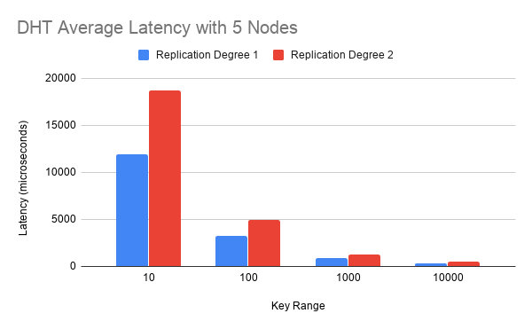
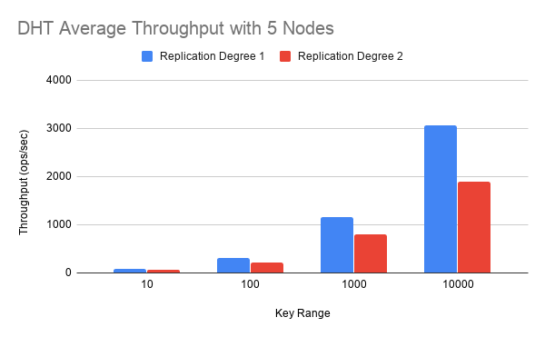

# Results
##### Overview
* DHT was run on 5 AWS EC2 instances. The instance type was t2.xlarge, which has 4 vCPUs, 16 GiB memory and "Moderate" 
    (~300-900Mb/s) network performance. All instances were hosted in the same region, us-east-1a. Testing was done with
    5 nodes, 8 client threads per node, and 10000 operations per client thread.

##### Interesting Observations/Notes
* Implemented MultiPut in a scalable way. You can modify how many puts you want to do in one multi-put in the properties
    file. Interesting to implement, ended up using a recursive function to acquire the necessary locks.
    
* Implemented metrics measuring as mentioned in class, where we have a thread that wakes up every now and then to record,
    and then goes back to sleep. This wasn't graphed, but during testing, I noticed that throughput would be lower during
    startup and gradually speed up as the test went on.
    
* Persistent connections was implemented, which made a huge change in performance for the assignment 1 version of the DHT.

* Implemented exponential backoff in a dynamic way. The amount of initial time that the client thread sleeps when it
    it has a request fails goes up when there is a smaller key range. In other words, smaller key range means bigger
    initial sleep time. By doing this, I was able to improve throughput/latency by a significant amount.

* Changed the number of buckets the hashtable has to be based off of the key range. The number of buckets is now always
    twice the number of keys. I choose twice (which is likely overkill), because performance is more of a concern to me
    than memory usage.

##### Charts

