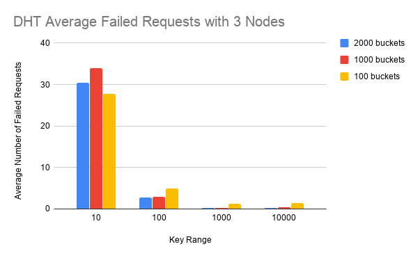
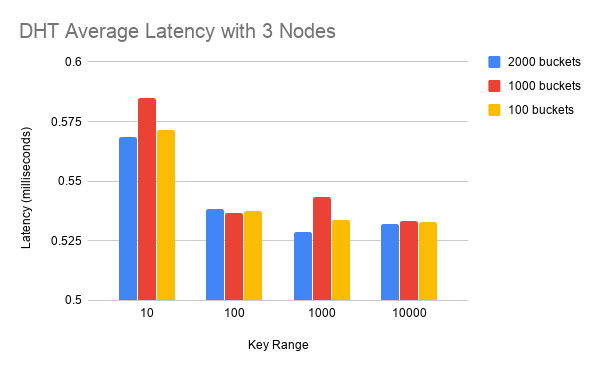
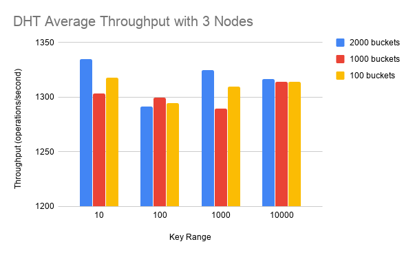

# Results
##### Overview
* DHT was run on 3 AWS EC2 instances. The instance type was t2.xlarge, which has 4 vCPUs, 16 GiB memory and "Moderate" (~300-900Mb/s) network performance.
All instances were hosted in the same region, us-east-1a.
* I ran the DHT with a variety of settings (i.e. number of threads, range of keys, number of buckets for the hash table)
 in order to try to get interesting results or trends.

##### Observations
* Sometimes one client would perform significantly worse than both of other clients.
I believe this occurs because of the initial hashing of the keys (A.K.A. deciding which node
each key goes to). I used the same hashing function, which means that the output for each hash
is consistent across runs (and our key values go from 0 to x, x being the upper limit), so I think that the underperforming 
client had less keys allocated to the server running on the same computer as it, resulting in it having to do more network communication,
hence the lower performance. This argument is also strengthened by the fact that the number of successful
puts is lower for the underperforming client, which makes sense since for the other clients, it is easier
to be the first to get a successful put (the first put of that key), since they don't have to do network
communication for their keys. The pattern of performance of each client for each node is relatively stable across the different ranges
of keys. However, for a range of 10, the client which usually underperforms nearly doubles the throughout of the other clients, which
leads me to believe that the numbers after 10 just happen to be hashing and mapping to the other 2 nodes more. However, the keys up to 10
are mapping to the that one node more than the other two. If we had a uniform hasher, then the performance measured by each client would
be much closer.

* Running the server with 6 threads versus 1 threads doesn't appear to have a significant affect on performance.
This makes sense because with the setup we have, at any time, any server can at most be doing 3 operations concurrently,
since we are running with 3 nodes. With more nodes, the increase of threads would have a more significant impact on performance.

##### Charts

